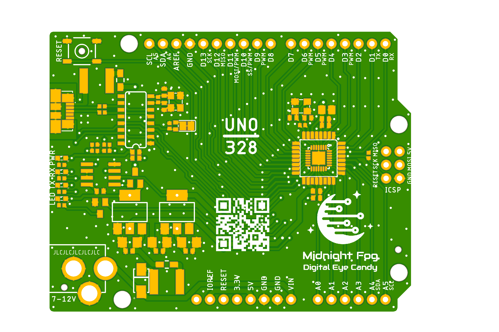

# UNO/328 project

UNO/328 is a clone board of popular Arduino Uno board.
Main goal of the project is to improve EMC property of original board keeping it still simple and cheap to produce.

## Uno_v1.0

**Uno_v1.0** is version 1.0 of the board featuring CH340G USB to UART chip and ATMEGA328P as MCU.

Preview:

[Schematics in PDF format](doc/Uno_v1.0.pdf)

Features:

- Uno compatible board pinout
- Uno compatible MCU ATMEGA328P
- 2 layer board design
- alternative footprints for MCU: TQFP and HVQFN
- CH340G chip as USB to UART bridge
- modern microUSB connector
- possibly better EMC parameters (not yet tested)

CAM files are available.
BoM and PnP files for JLCPCB are available.

## Links

- CH340G Driver for Windows: [CH341SER_ZIP](http://www.wch.cn/download/CH341SER_ZIP.html)

## How to help

Your contributions as code, resources or finances are welcome!
Please contact me directly over e-mail andriy.golovnya@gmail.com or over [GitHub profile](https://github.com/red-scorp).
Link for [Paypal donations](http://paypal.me/redscorp) and [Ko-Fi donations](http://ko-fi.com/redscorp), which are always welcome.
Thanks in advance!
